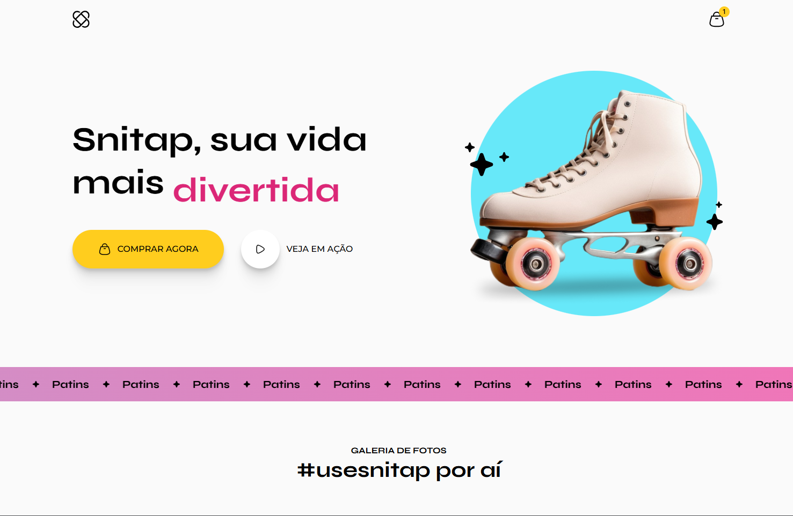

---

# 🚀 Projeto Page Animation

---

## 📜 Sobre o Projeto

Este projeto é uma página web simples com foco em **animações**, desenvolvido como parte da trilha de aprendizagem **Full Stack da Rocketseat**, sob a instrução de **Mayk Brito**. O objetivo principal foi praticar e aplicar conceitos de animações utilizando `transform`, `transition`, e a criação de `keyframes` para manter uma animação bonita e agradável.

> 💡 **Nota:** A responsividade **não** foi o foco deste projeto.

---

## 🛠️ Tecnologias Utilizadas

- **IDE:** VS Code *(ambiente de desenvolvimento)*
- **Navegador:** Microsoft Edge *(navegador de testes)*
- **Design:** Figma *(para referência visual)*
- **Tecnologias:** HTML, CSS

---

## 📂 Estrutura do Projeto

```
📦 projeto-page-animation/
├── 📁 assets
│   ├── 📁 hero/
│   ├── 📁 icons/
│   ├── 📁 images/
├── 📁 css/
│   ├── styles.css
│   ├── nav.css
│   ├── buttons.css
│   ├── header.css
│   ├── footer.css
│   ├── global.css
│   ├── banner.css
├── index.html
├── README.md
```

---

## 🌍 Deploy

O projeto está disponível online: **[AQUI](#)**

---

## 📌 Como Executar

1. Clone este repositório:

   ```bash
   git clone https://github.com/devmoisessantos/projeto-page-animation.git
   ```

2. Acesse a pasta do projeto:

   ```bash
   cd projeto-page-animation
   ```

3. Abra o arquivo `index.html` no navegador.

---

## 📞 Contato

**Moisés Santos**  
🔗 [LinkedIn](https://www.linkedin.com/in/devmoises-santos)  
🐙 [GitHub](https://github.com/devmoisessantos)  
📧 [Email](mailto:devmoisessantos@gmail.com)

---

💡 **Feito com dedicação por Moisés Santos** 🎨🚀
